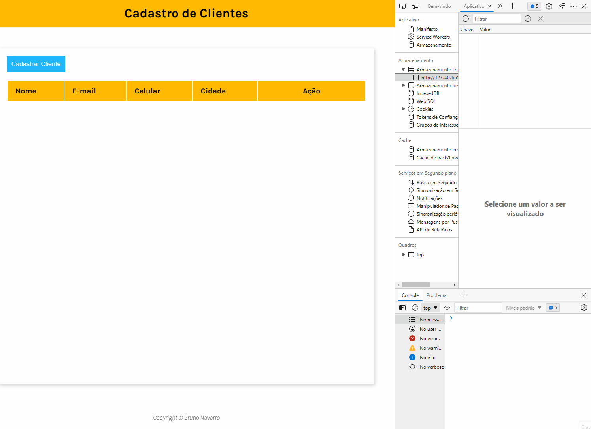
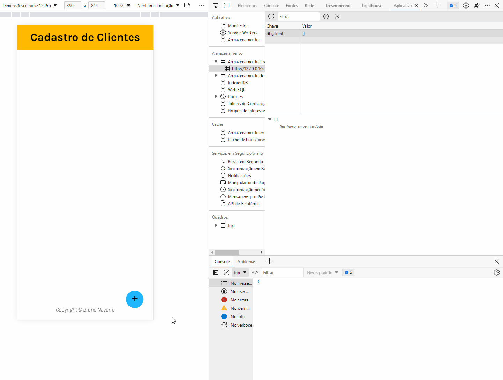

# CRUD LocalStorage 🔄

Armazenando dados dentro de um Array no LocalStorage.

#
Deploy Netlify ☁️:

[Crud LocalStorage](https://crud-localstrorage-bn.netlify.app/)
#

* CRUD:
    * [x] Código para Armazenar Dados no LocalStorage da Página
    * [x] Código para Buscar Dados no LocalStorage da Página
    * [x] Código para Atualizar Dados no LocalStorage da Página
    * [x] Código para Deletar Dados no LocalStorage da Página

* Stacks 📚 and Skills 🧠:

    * HTML
        * Tags Semânticas
        * Regex
        * Bibliotécas externas:
            * [Google Fonts](https://fonts.googleapis.com)
    * CSS
        * Flex-Box
        * Media Query        
    *  JavaScript 
        * DOM
        * Eventos
        * Funções
#

<h3>Page 📑:</h3>
<h4>Cadastrando Clientes 📑:</h3>

#

<h3>Responsive Mobile📲:</h3>
<h4>Cadastrando Clientes 📑:</h3>

